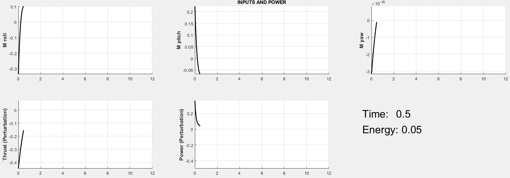

# Quadcopter Thesis

Implementation of LQR and LQG Controllers for Quadcopter Control

Description:

This project focuses on the implementation of two popular control strategies, namely LQR (Linear Quadratic Regulator) and LQG (Linear Quadratic Gaussian), for quadcopter control. Quadcopters are highly nonlinear systems with complex dynamics, making them challenging to control. The LQR and LQG controllers are widely used in control engineering due to their simplicity, effectiveness, and robustness.

The LQR controller is a feedback control strategy that minimizes a cost function consisting of the state and control inputs. The LQG controller combines the LQR controller with a Kalman filter to estimate the system's state. Both controllers are designed to minimize the quadcopter's response to disturbances and uncertainties.

**Testing LQR/LQG in realistic animations**

<table>
  <tr>
    <td>
      <figure>
        
        <figcaption>LQR</figcaption>
      </figure>
    </td>
    <td>
      <figure>
        
        <figcaption>LQG</figcaption>
      </figure>
    </td>
  </tr>
</table>

**Testing LQR/LQG in realistic animations**

<table>
  <tr>
    <td>
      <figure>
        
        <figcaption>LQR</figcaption>
      </figure>
    </td>
    <td>
      <figure>
        
        <figcaption>LQG</figcaption>
      </figure>
    </td>
  </tr>
</table>

**Testing LQR/LQG in realistic animations**

<table>
  <tr>
    <td>
      <figure>
        
        <figcaption>LQR</figcaption>
      </figure>
    </td>
    <td>
      <figure>
        
        <figcaption>LQG</figcaption>
      </figure>
    </td>
  </tr>
</table>

**Testing LQR changing Q-R**

<table>
  <tr>
    <td>
      <figure>
        
        <figcaption>HIGH Q</figcaption>
      </figure>
    </td>
    <td>
      <figure>
        
        <figcaption>HIGH R</figcaption>
      </figure>
    </td>
  </tr>
</table>

**DIAGRAMS OUTPUTS**

<table>
  <tr>
    <td>
      <figure>
        
        <figcaption>HIGH Q</figcaption>
      </figure>
    </td>
    <td>
      <figure>
        
        <figcaption>HIGH R</figcaption>
      </figure>
    </td>
  </tr>
</table>

**DIAGRAMS INPUTS-POWER**
<table>
  <tr>
    <td>
      <figure>
        
        <figcaption>HIGH Q</figcaption>
      </figure>
    </td>
    <td>
      <figure>
        
        <figcaption>HIGH R</figcaption>
      </figure>
    </td>
  </tr>
</table>

**Testing LQG changing Q-R with w=0.001 and v=0.001**

<table>
  <tr>
    <td>
      <figure>
        
        <figcaption>HIGH Q</figcaption>
      </figure>
    </td>
    <td>
      <figure>
        
        <figcaption>HIGH R</figcaption>
      </figure>
    </td>
  </tr>
</table>

**DIAGRAMS**

<table>
  <tr>
    <td>
      <figure>
        
        <figcaption>HIGH Q</figcaption>
      </figure>
    </td>
    <td>
      <figure>
        
        <figcaption>HIGH R</figcaption>
      </figure>
    </td>
  </tr>
</table>

**DIAGRAMS INPUTS-POWER**

<table>
  <tr>
    <td>
      <figure>
        
        <figcaption>HIGH Q</figcaption>
      </figure>
    </td>
    <td>
      <figure>
        
        <figcaption>HIGH R</figcaption>
      </figure>
    </td>
  </tr>
</table>

